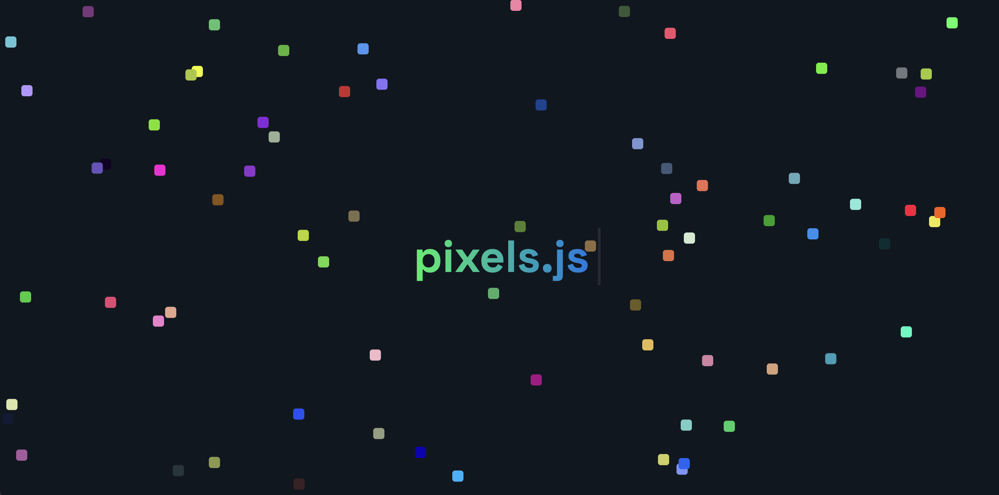

# 🌈 pixels.js

**Pixels.js** is a fun visual experiment built with pure HTML, CSS, and JavaScript ✨. It features colorful pixel-like blocks falling from the top like rain, combined with a looping typewriter animation that displays **pixels.js** letter by letter — disappearing and reappearing endlessly.

## ✨ Features

- 🌧️ **Pixel Rain Effect**: Colorful divs fall from the top like animated pixels.
- ⌨️ **Typewriter Animation**: Text appears one letter at a time in the center.
- 🔁 **Looping Effect**: The text disappears and reappears continuously.
- 🎨 **CSS Animations**: Smooth transitions and visual effects using pure CSS.
- ⚡ **Lightweight & Fun**: No libraries — just creative front-end animation.

## 🚀 Live Demo

No installation needed – it’s 100% online!

Try it out here 👉 [Pixels.js by Faraaz Ansari](https://thefaraazansari.github.io/pixels.js/)

## 📸 Screenshot

## 🎯 Who is this for?

- Frontend Developers 💻  
- CSS Animation Enthusiasts 🎬  
- Creative Coders 🎨  
- Anyone who enjoys fun UI experiments ✨  

---

Made with ❤️ by **Faraaz Ansari**
